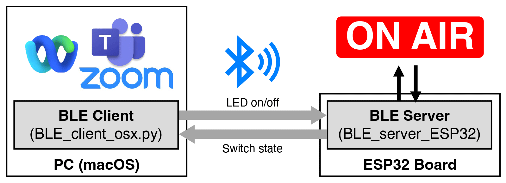
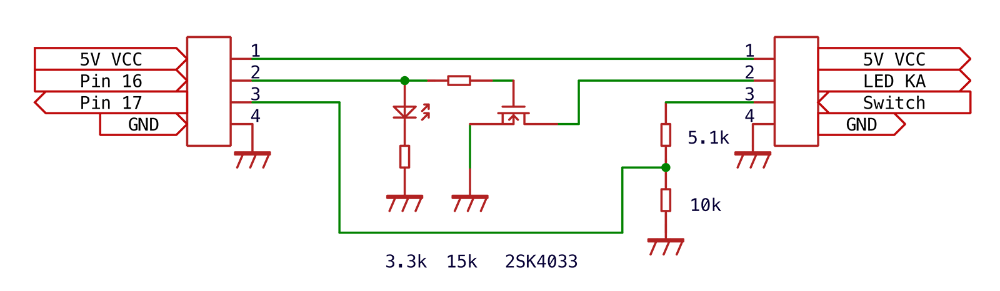

# BLE Server/Client for "On Air" Signboard

A BLE server - client kit to remotely turn on/off LED, an "On Air" signboard in my application.

It turns on the LED when Zoom, WebEx or Microsoft Teams process is running on a PC (macOS), to indicate you are 'on air' now.
It can also receive the status of switch at the signbaord.

## Preliquiste

### BLE\_client_\osx.py

- macOS PC
- bleak : `pip install bleak`

### BLE\_server\_esp32

- ESP32 board computer
- LED signboard (any) + I/O circuit
- Visual Studio Code / Platform IO

### Circuit Example

I used pin 16 and 17 of Esp32.
Other pins except those with special functions should work.
I used [ESP-WROOM-32 from Switch Science](https://www.switch-science.com/products/6364).
M5Stack etc should also work.

### LED signboard

LED signboards are very simple in terms of electronics.
It uses USB power to turn on a line of LEDs.
The switch to turn on/off can be as simple as a mechanical switch,
or silicon switch with brightness adjustment.
I wanted to allow manually turn on/off it,
so I left the original switch circuit.
To obtain the status change of the manual switch,
a signal is taken from the circuit.
It depends on the circuit of your signboard.
Therefore, you need to find such signal using a tester.
In the above circuit, the signal is divided by registers.
It is because while the signal is 0/5V,
Esp32 accepts 3.3V input.

# Acknowledgemnt

BLE\_server\_esp32's c++ code is originally from ["ESP32でBLEデバイスを作る" by Luup Developers Blog](https://zenn.dev/luup/articles/iot-yamaguchi-20221204), on Dec 2022.

# License

The MIT License (MIT) Copyright (c) K. Chinzei (kchinzei@gmail.com) Permission is hereby granted, free of charge, to any person obtaining a copy of this software and associated documentation files (the "Software"), to deal in the Software without restriction, including without limitation the rights to use, copy, modify, merge, publish, distribute, sublicense, and/or sell copies of the Software, and to permit persons to whom the Software is furnished to do so, subject to the following conditions: The above copyright notice and this permission notice shall be included in all copies or substantial portions of the Software. THE SOFTWARE IS PROVIDED "AS IS", WITHOUT WARRANTY OF ANY KIND, EXPRESS OR IMPLIED, INCLUDING BUT NOT LIMITED TO THE WARRANTIES OF MERCHANTABILITY, FITNESS FOR A PARTICULAR PURPOSE AND NONINFRINGEMENT. IN NO EVENT SHALL THE AUTHORS OR COPYRIGHT HOLDERS BE LIABLE FOR ANY CLAIM, DAMAGES OR OTHER LIABILITY, WHETHER IN AN ACTION OF CONTRACT, TORT OR OTHERWISE, ARISING FROM, OUT OF OR IN CONNECTION WITH THE SOFTWARE OR THE USE OR OTHER DEALINGS IN THE SOFTWARE.
